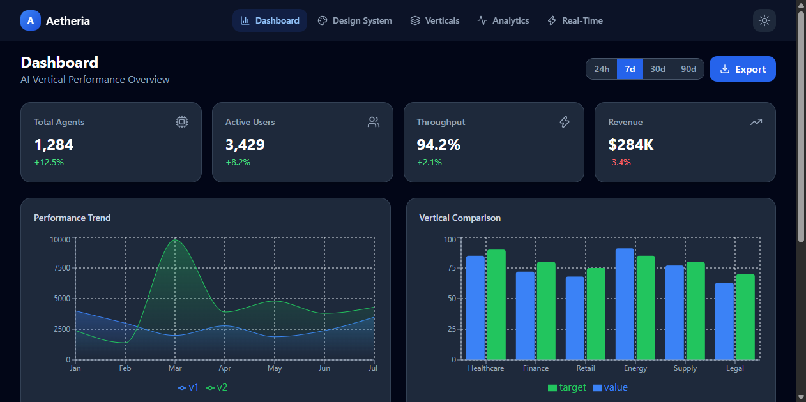
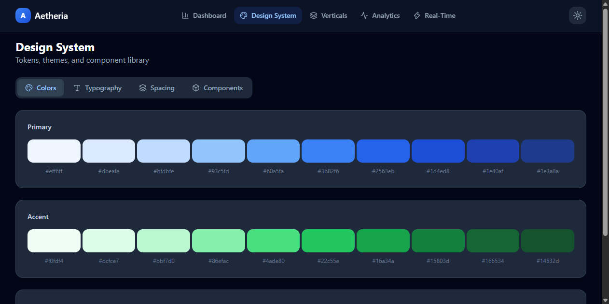
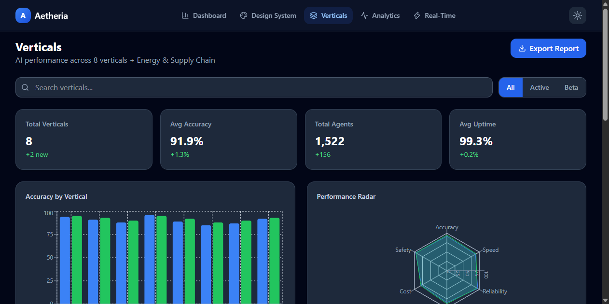
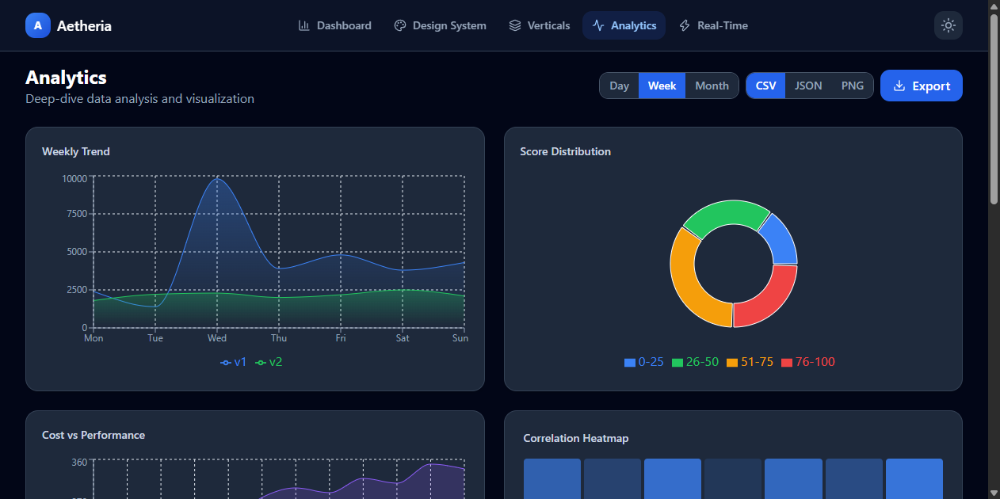
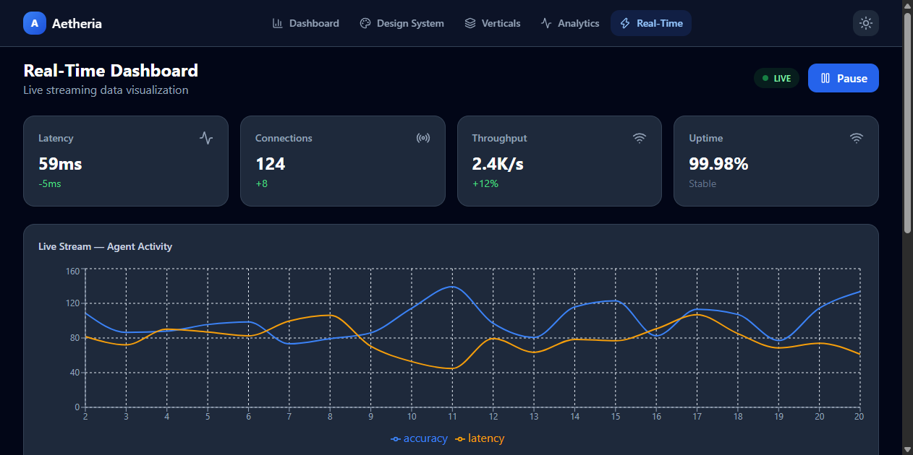

# Aetheria — Vertical AI Showcase

Advanced UI/UX for Vertical AI Showcase. Production-grade frontend built with React, TypeScript, Vite, Tailwind CSS, and Recharts.

## Features

### 1. Design System Pages
- **Colors** — Full token palette (Primary, Accent, Surface) with 10 shades each
- **Typography** — Display, Headings (H1-H3), Body, Small, XS with size/weight specs
- **Spacing** — Visual scale from 0.25rem to 6rem
- **Components** — Buttons (Primary, Secondary, Outline, Ghost), Inputs, Cards, Border Radius

### 2. Data Visualization Components
- **8 Chart Types** — Area, Line, Bar, Pie, Radar, Scatter, Heatmap, Stacked
- **8 Verticals** — Healthcare, Finance, Retail, Energy, Supply Chain, Legal, Education, Manufacturing
- **Interactive Filters** — Search, status filter, time range selector
- **Export** — CSV, JSON, PNG export buttons with history

### 3. Real-Time Dashboard
- **Live Streaming** — 1-second interval data updates
- **Live Events Feed** — Real-time activity log
- **Connection Status** — Node health grid
- **Pause/Resume** — Control live stream

### 4. Accessibility & Responsive
- **Dark Mode** — Full dark theme with system preference detection
- **Responsive** — Mobile-first design, works on all screen sizes
- **Keyboard Navigation** — Focus states, ARIA labels, skip-to-content link
- **Semantic HTML** — Proper landmarks and roles

## Tech Stack

| Technology | Purpose |
|------------|---------|
| React 19 | UI Framework |
| TypeScript 6 | Type Safety |
| Vite 8 | Build Tool |
| Tailwind CSS 4 | Styling |
| Recharts 3 | Charts |
| React Router 7 | Navigation |
| Lucide React | Icons |

## Getting Started

```bash
# Install dependencies
npm install

# Start development server
npm run dev

# Build for production
npm run build

# Preview production build
npm run preview

# Lint code
npm run lint
```

## Project Structure

```
src/
├── components/
│   ├── Card.tsx         # Card and StatCard components
│   ├── Charts.tsx       # 8 chart components + ChartCard
│   ├── Layout.tsx       # Navigation layout with theme toggle
│   └── Skeleton.tsx     # Loading skeleton components
├── context/
│   ├── ThemeContext.ts  # Theme context definition
│   └── ThemeProvider.tsx # Theme state management
├── hooks/
│   └── useTheme.ts      # Theme hook
├── pages/
│   ├── Dashboard.tsx    # Overview with stats and charts
│   ├── DesignSystem.tsx # Tokens, typography, components
│   ├── Verticals.tsx    # 8 verticals with filters
│   ├── Analytics.tsx    # Deep-dive with export
│   ├── RealTime.tsx     # Live streaming dashboard
│   └── NotFound.tsx     # 404 page
├── App.tsx              # Router setup
├── main.tsx             # Entry point
└── index.css            # Tailwind + custom tokens
```

## Design Tokens

The design system uses CSS custom properties for all tokens:

- **Primary** — Blue scale (50-950)
- **Accent** — Green scale (50-950)
- **Surface** — Slate scale (50-950)
- **Border Radius** — sm, md, lg, xl, 2xl
- **Shadows** — sm, md, lg, xl

## Screenshots

### Dashboard


### Design System


### Verticals


### Analytics


### Real-Time Dashboard


## License

MIT
